# Avtomaktab uchun All-in-One (CRM + ERP + LMS + Guvohnomalar + Bot Chat Qabul) Tizimini Joriy Qilish Rejasi

Mazkur reja **AutoPrimeBot** tizimini O‘zbekiston avtomaktablari uchun to‘liq moslashtirilgan, **O‘quvchi hech qanday veb-sahifasiz to‘g‘ridan-to‘g‘ri Telegram Bot Chatida ketma-ket savol-javob orqali anketani to‘ldirishi, rasmlarni yuklashi, 1-klik shartnoma, Kassa, Darslar, Testlar va Bitiruv Guvohnomasigacha bo‘lgan 100% to‘liq platforma**ga aylantirish uchun ishlab chiqildi:

* 🤖 **Telegram Bot Chatida Ketma-ket Anketa To‘ldirish (Conversational Chat Wizard)**: 
  Bo‘lajak o‘quvchi hech qanday tashqi sayt ochmasdan, to‘g‘ridan-to‘g‘ri bot chatida ketma-ket savollarga javob beradi:
  1. 👤 **F.I.O** (Ism, familiya, sharif)
  2. 📱 **Telefon raqami** (*"Kontaktni ulashish"* bitta tugma orqali)
  3. 🚗 **Toifa tanlash** (*B, A, C* tugmalari orqali)
  4. 🏢 **Filial tanlash** (*Chilonzor, Yunusobod va h.k.* tugmalari)
  5. ⏰ **Qulay o‘qish vaqti** (*Ertalabki, Kunduzgi, Kechki* tugmalari)
  6. 📸 **Pasport / ID karta rasmi** (Telefon kamerasidan yoki galereyadan to‘g‘ridan-to‘g‘ri rasm qilib tashlaydi — *shifrlangan saqlanadi*)
  7. 👤 **3x4 rasm / Selfi** (Bot chatiga rasm qilib yuboradi)
  8. 📅 **Tug‘ilgan sana va Yashash manzili**
  9. 🔢 **JSHSHIR (PINFL)** (14 xonali — *shifrlangan saqlanadi*)
* ⚡ **Receptionga Xabar va 1-Klikda Shartnoma**: Bot anketani qabul qilishi bilan Reception xodimiga bildirishnoma boradi. Reception barcha yuklangan rasmlar va ma'lumotlarni ko‘rib, 1-klik bilan talaba (`students`) va shartnoma (`contracts`)ga aylantiradi.
* 🔐 **Spatie RBAC & Permissions Matrix** (7 ta rol, `model_has_roles` va `model_has_permissions` orqali to‘g‘ridan-to‘g‘ri ruxsatlar)
* 💳 **Moliyaviy Yaxlitlik & Non-negative Kassalar**: 
  - DB CHECK constraint (`balance >= 0`, `debt_amount >= 0`, `salary_balance >= 0`) + `DB::transaction()` + `lockForUpdate()`;
  - Keshlangan summalarning drift xavfini oldini olish uchun kunlik yarim kechasi avtomatik `ReconcileFinancialBalancesJob` hisob-kitob tekshiruvi;
  - `contracts.overpaid_amount` (ortiqcha to‘lovlar monitoringi) va `salaries.is_deduction` (jarima va avanslar aniq belgisi).
* 🛡️ **Xavfsizlik va Shaxsiy Ma'lumotlarni Himoyalash (PII Encryption)**:
  - `pinfl`, `passport_series`, `passport_number`, `passport_photo_url`, `medical_certificate_photo_url` maydonlari model darajasida Laravel `encrypted` cast bilan saqlanadi.
* 📋 **Audit va Xatti-harakatlar Tarixi (`spatie/laravel-activitylog`)**:
  - Shartnomalarni tahrirlash, ochiq smenadagi to‘lovlarni tuzatish, kassa transferlarini tasdiqlash va oylik hisoblash amallari to‘liq kim tomonidan qachon va qanday o‘zgartirilgani (old/new diff) qayd etiladi.
* 🚗 **Avtopark Normalizatsiyasi**:
  - Xodimlar jadvalidan mashina maydonlari chiqarilib, `vehicles` jadvali orqali boshqariladi va `drivings.vehicle_id` orqali har bir dars o‘tilgan avtomobil aniq bog‘lanadi.
* 📱 **Darslar & Davomat** (One-Time Dynamic QR & Telefonsizlar uchun Manual Davomat)
* 📚 **LMS Testlar & Imtihon (4 Tilda: uz, ru, krill, en)**:
  - Prava24 1190+ savolli 25 min taymerli simulyator, biletlar, savollar, javoblar va yo‘l belgilari 4 ta tilda to‘liq ishlaydi.
* 🎓 **Bitirish & Sertifikat/Guvohnoma** (QR-kodli rasmiy bitiruv guvohnomasi PDF)
* 📜 **Gibrid Balans & UNION Moliyaviy Tarixlar** (Student, Kassa, Xodim ko‘chirmalari)
* 📲 **Telegram Mini App** (O‘quvchining to‘liq shaxsiy kabineti)

---

## O‘quvchining To‘liq Hayotiy Sikli (Bot Qabulidan ➡️ Sertifikatgacha)

```
1. TELEGRAM BOT CHATIDA KETMA-KET QABUL ANKETASI (Bot Chat Wizard & CRM Leads)
   ├── Bot: "F.I.O ingizni kiriting" ➡️ O'quvchi yozadi
   ├── Bot: [📱 Kontaktni yuborish] ➡️ O'quvchi bosadi
   ├── Bot: Toifani tanlang: [🚗 B toifa] [🏍️ A toifa] [🚛 C toifa]
   ├── Bot: Filialni tanlang: [🏢 Chilonzor] [🏢 Yunusobod]
   ├── Bot: Qulay vaqt: [🌅 Ertalabki] [☀️ Kunduzgi] [🌙 Kechki]
   ├── Bot: "Pasportingiz rasmini yuboring" ➡️ O'quvchi rasm tashlaydi (Encrypted)
   ├── Bot: "3x4 rasmingizni yuboring" ➡️ O'quvchi rasm tashlaydi
   └── Bot: "Tug'ilgan sana va manzilingizni kiriting" ➡️ O'quvchi yozadi.

2. RECEPTION GA BILDIRISHNOMA & 1-KLIK BILAN SHARTNOMA
   └── Reception panelida barcha rasmlar va ma'lumotlar avtomat tayyor bo'ladi. 
       Reception tekshirib, 1-klik bilan Student va Contract ochadi va guruhga biriktiradi.

3. TO'LOV QABUL QILISH (Payments & Cash Registers)
   └── Kassir to'lovni shartnomaga qabul qiladi (Naqd / Karta). 
       Qoldiq qarz kamayadi, Kassa balansi oshadi (DB CHECK balance >= 0, lockForUpdate).

4. NAZARIY TA'LIM VA DAVOMAT (Lesson Sessions & Attendance)
   └── O'qituvchi dars ochadi. Ekranda har 15s yangilanuvchi Dynamic QR token. 
       O'quvchi bot orqali skanerlaydi (telefoni yo'qlarni xodim qo'lda belgilaydi).

5. AMALIY HAYDASH (Drivings & Instructors & Vehicles)
   └── Instruktor va aniq mashina (vehicle_id) bo'yicha amaliy dars slotlari. 
       Dars yakunlangach, o'quvchi instruktorga baho (Review) qo'yadi.

6. TEST VA ICHKI IMTIHON (LMS & Mock Exam — 4 Tilda)
   └── Prava24 ning 1190+ savollar bazasida 4 tilda (uz, ru, krill, en) mashq qiladi. 
       Ichki imtihondan o'tadi (20 savoldan kamida 18 ta to'g'ri javob).

7. BITIRISH & GUVOHNOMA/SERTIFIKAT (Certificates)
   └── Barcha shartlar bajarilgach (Talabaning BARCHA faol shartnomalari bo'yicha umumiy qarzi 0, 
       davomat >= 70%, haydash soatlari o'tilgan, imtihondan o'tgan) 
       o'quvchiga rasmiy QR-kodli Bitiruv Guvohnomasi chiqariladi va PDF chop etiladi.

8. BUXGALTERIYA & KASSA TRANSFERI (Finance & Payroll)
   └── Xarajatlar (Ijara, reklama), Xodimlar oyligi (Salaries: is_deduction & Salary Payments) beriladi. 
       Kassa smenasi yopilib Admin kassaga transfer qilinadi. Barcha operatsiyalar ActivityLog'da saqlanadi.

9. XRONOLOGIK TARIX & AUDIT (UNION Statements & Drift Reconciliation)
   └── Talabaning to'liq qarz tarixi, Kassaning barcha kirim/chiqim qoldiqlari, 
       Xodimning oylik ko'chirmasi va har kecha avtomatik moliyaviy muvofiqlik (Reconciliation) tekshiruvi.
```

---

## Foydalanuvchi Tasdiqlagan Asosiy Qoidalar

### 🔐 1. Rollar va Ruxsatlar Matritsasi (`spatie/laravel-permission`):
Tizimda **Spatie Multi-Role (`model_has_roles`)** va **To‘g‘ridan-to‘g‘ri Ruxsatlar (`model_has_permissions`)** qo‘llaniladi. Bitta xodim bir vaqtning o‘zida bir nechta rolga ega bo‘lishi mumkin (masalan: `teacher + instructor`).

#### 7 ta Asosiy Rol:
1. **`super_admin`**: Barcha filiallar, tizim sozlamalari, audit loglar va **Markaziy Admin Kassalar (`branch_id = null`)**ning yagona boshqaruvchisi.
2. **`admin`**: O‘z filialidagi barcha jarayonlarni nazorat qiluvchi filial rahbari.
3. **`accountant` (Buxgalter)**: Moliyaviy hisobotlar, xodimlar oyligini belgilash, kassa transferlarini audit qilish va tahlil.
4. **`reception`**: Yangi o‘quvchilarni qabul qiladi, shaxsiy anketasini kiritadi, **shartnoma tuzadi (narx, chegirma belgilaydi)**, guruhga biriktiradi va **sertifikat/guvohnoma** chiqaradi.
5. **`kassir`**: Filialdagi Naqd va Karta kassalariga to‘lovlarni qabul qiladi, **kassadan xarajatlar va oyliklarni to‘laydi (chiqim)**, kassa smenasini yopadi va pullarni mos Admin Kassaga transfer qiladi.
6. **`teacher`**: Nazariy dars o‘qituvchisi (Dars sessiyasini ochadi, ekranga Dinamik QR chiqaradi va davomatni oladi).
7. **`instructor`**: Amaliy haydash instruktori (Avtomobili va vaqt slotlarida o‘quvchilar bilan amaliy dars o‘tadi).

---

### 📋 To‘liq Permissions (Ruxsatlar) Ro‘yxati:

#### 1. 📊 Boshqaruv & Tahlil (Dashboard & Analytics)
| Permission | Turi | Vazifasi |
|---|---|---|
| `dashboard.view` | *Sidebar* | Boshqaruv panelini ko‘rish |
| `kpi.view` | *Sidebar/Action* | Xodimlar va filiallar KPI reytingi va tahlilini ko‘rish |
| `audit.view` | *Sidebar/Action* | Tizim audit jurnali va xatti-harakatlar tarixini ko‘rish (*Superadmin*) |

#### 2. 🏢 Filiallar va Xodimlar (Core & Users)
| Permission | Turi | Vazifasi |
|---|---|---|
| `branches.view` | *Sidebar* | Filiallar ro‘yxatini ko‘rish |
| `branches.manage` | *Action* | Yangi filial ochish, tahrirlash, o‘chirish |
| `users.view` | *Sidebar* | Xodimlar ro‘yxatini ko‘rish |
| `users.manage` | *Action* | Yangi xodim qo‘shish, rol biriktirish, tahrirlash |
| `roles.manage` | *Action* | Rollar va ruxsatlarni sozlash (*Superadmin*) |

#### 3. 🎓 O‘quvchilar va Guruhlar (Students & Groups)
| Permission | Turi | Vazifasi |
|---|---|---|
| `students.view` | *Sidebar* | O‘quvchilar ro‘yxatini ko‘rish |
| `students.create` | *Action* | Yangi o‘quvchi anketasini kiritish (*Reception*) |
| `students.edit` | *Action* | O‘quvchi ma'lumotlarini tahrirlash |
| `students.delete` | *Action* | O‘quvchini o‘chirish / arxivlash |
| `groups.view` | *Sidebar* | Guruhlar ro‘yxatini ko‘rish |
| `groups.manage` | *Action* | Guruh ochish, dars boshlash/tugatish |

#### 4. 📄 Shartnomalar va Sertifikatlar (Contracts & Certificates)
| Permission | Turi | Vazifasi |
|---|---|---|
| `contracts.view` | *Sidebar* | Shartnomalar va qoldiq qarzdorlar ro‘yxatini ko‘rish |
| `contracts.create` | *Action* | Yangi shartnoma tuzish (narx, chegirma belgilash) |
| `contracts.edit` | *Action* | Shartnoma summasi va shartlarini tahrirlash (*Audit loglanadi*) |
| `contracts.print` | *Action* | PDF shartnomani yuklab olish va chop etish |
| `certificates.view` | *Sidebar* | Bitiruvchilar va berilgan guvohnomalar ro‘yxatini ko‘rish |
| `certificates.create` | *Action* | Imtihondan o‘tgan talabaga Bitiruv Guvohnomasi chiqarish |
| `certificates.print` | *Action* | QR-kodli rasmiy Guvohnoma PDF faylini chop etish |

#### 5. 💳 Moliya, Kassalar va Chiqimlar (Finance & Cashbox)
| Permission | Turi | Vazifasi |
|---|---|---|
| `finance.view` | *Sidebar* | Moliya va kassalar bo‘limini ko‘rish |
| `cash_registers.view` | *Action* | Kassa balanslari va ko‘chirmasini (Statement) ko‘rish |
| `payments.create` | *Action* | O‘quvchi shartnomasiga to‘lov qabul qilish va chek chiqarish (*Kassir*) |
| `payments.edit` | *Action* | Ochiq smenadagi to‘lovni tahrirlash (*Audit loglanadi*) |
| `expenses.create` | *Action* | Kassadan xarajat chiqimini qilish (*Ijara, reklama, banner va h.k.*) |
| `expense_categories.manage`| *Action* | Xarajat toifalarini yaratish va boshqarish |
| `cash_shifts.close` | *Action* | Kassa smenasini yopish |
| `cash_transfers.create` | *Action* | Admin kassaga transfer jo‘natish |
| `cash_transfers.approve`| *Action* | Admin kassada transferni qabul qilish (*Superadmin, Audit loglanadi*) |
| `admin_treasury.manage` | *Sidebar/Action*| Markaziy Admin Kassani boshqarish (*Superadmin*) |

#### 6. 💼 Xodimlar Oyligi (Payroll & Salaries)
| Permission | Turi | Vazifasi |
|---|---|---|
| `salaries.view` | *Sidebar* | Oyliklar ro‘yxati va xodim oylik tarixini ko‘rish |
| `salaries.accrue` | *Action* | Xodimlarga oylik/jarima/avans belgilash (*Accountant/Admin, Audit loglanadi*) |
| `salaries.pay` | *Action* | Kassadan oylik to‘lash (payout) |

#### 7. 📱 Davomat (Attendance & Sessions)
| Permission | Turi | Vazifasi |
|---|---|---|
| `attendance.view` | *Sidebar* | Davomat jurnali va foizlarini ko‘rish |
| `attendance.start_session`| *Action* | Nazariy dars ochish va ekranga Dinamik QR chiqarish (*Teacher*) |
| `attendance.mark_manual` | *Action* | **Telefoni yo‘q o‘quvchini darsga qo‘lda belgilash** (*Admin, Reception, Teacher*) |
| `attendance.export` | *Action* | Davomat jurnalini Excelga eksport qilish |

#### 8. 🚗 Amaliy Haydash (Drivings & Instructors)
| Permission | Turi | Vazifasi |
|---|---|---|
| `drivings.view` | *Sidebar* | Haydash jadvallari va slotlarni ko‘rish |
| `drivings.manage` | *Action* | Haydash darslarini rejalashtirish (mashina tanlash bilan), o‘tildi deb belgilash |
| `autodromes.manage` | *Action* | Avtodromlarni kiritish va tahrirlash |
| `reviews.view` | *Action* | Instruktorlarga qo‘yilgan baho va sharhlarni ko‘rish |

#### 9. 📚 LMS & Prava24 Testlar
| Permission | Turi | Vazifasi |
|---|---|---|
| `lms.view` | *Sidebar* | Testlar va imtihonlar bo‘limini ko‘rish |
| `tickets.manage` | *Action* | Biletlar va 1190 ta savollar bazasini boshqarish (4 tilda) |
| `attempts.view` | *Action* | O‘quvchilarning imtihon natijalari statistikasini ko‘rish |

#### 10. 👥 CRM & 🚙 Avtopark (CRM & Fleet)
| Permission | Turi | Vazifasi |
|---|---|---|
| `crm.view` | *Sidebar* | CRM Lidlar Kanban doskasini ko‘rish |
| `leads.manage` | *Action* | Yangi lid qo‘shish, bot arizalarini ko‘rish va talabaga aylantirish |
| `fleet.view` | *Sidebar* | Avtoparkdagi mashinalar ro‘yxatini ko‘rish |
| `fleet.manage` | *Action* | Mashina qo‘shish, moy/gaz/sug‘urta eslatmalarini kiritish |

---

### 🚫 2. Qat'iy Musbat Balans Qoidasi va Moliyaviy Yaxlitlik (Financial Integrity & No-Drift):
- **DB CHECK Constraint & Row Lock:** 
  - `cash_registers.balance >= 0`
  - `contracts.debt_amount >= 0`
  - `users.salary_balance >= 0`
  - Barcha balans yangilanishlari (to‘lov, chiqim, transfer, oylik to‘lovi) `DB::transaction()` va `lockForUpdate()` bilan o‘raladi.
- **Keshlangan Summalar Driftini Oldini Olish (Reconciliation):**
  - `contracts.paid_amount`, `contracts.debt_amount`, `cash_registers.balance`, `cash_shifts.total_income/closing_balance`, `users.salary_balance` ustunlari har tranzaksiyada atomar yangilanadi.
  - Har kecha (00:00 da) avtomatik ravishda `ReconcileFinancialBalancesJob` ishga tushadi: u barcha tranzaksiya jadvallaridan (`payments`, `expenses`, `salary_payments`, `cash_transfers`) xom summalarni qayta hisoblab, keshlangan qiymatlar bilan solishtiradi va tafovut bo‘lsa Superadminga xabar beradi.
- **Talabalar Ortiqcha To‘lovi:** `contracts.overpaid_amount >= 0` orqali alohida kuzatiladi.
- **Oylik Hisoblash Belgisi:** `salaries.is_deduction` (jarima va avanslar uchun `true`, asosiy oylik va dars bay oyliklar uchun `false`) — shunda summa (`amount`) doim musbat saqlanadi.

### 🎓 3. Bitirish Shartlari va Guvohnoma Berish Qoidalari:
O‘quvchiga Bitiruv Guvohnomasi (`certificates`) rasmiylashtirilishi uchun quyidagi 4 ta shart tizim tomonidan qat'iy tekshiriladi:
1. **Shartnomalar to‘lovi:** Talabaning avtomaktabdagi **BARCHA faol shartnomalari bo‘yicha umumiy qarzdorligi 0 bo‘lishi shart** (`Student->contracts()->where('status', 'active')->sum('debt_amount') == 0`). Talabaning hech qanday kurs yoki qo‘shimcha xizmatdan qarzi qolmagan bo‘lishi lozim.
2. **Davomat:** Nazariy darslarda qatnashish foizi kamida 70% bo‘lishi.
3. **Amaliy haydash:** Belgilangan barcha haydash mashg‘ulotlari o‘tilgan bo‘lishi.
4. **Ichki imtihon:** LMS test sinovidan muvaffaqiyatli o‘tgan bo‘lishi (`is_passed = true`).

---

## Tizimning 10 Bosqichli Ketma-ket Jarayoni

```mermaid
graph TD
    subgraph STEP1 ["1️⃣ 1-BOSQICH: Rollar va Foydalanuvchilar (Spatie RBAC & Permissions)"]
        direction TB
        S1["Xodimlar: Superadmin, Admin, Accountant, Kassir, Reception, Teacher, Instructor"]
        S1 --> S1_1["Multi-Role: Bitta xodim bir vaqtda Teacher + Instructor bo'la oladi"]
        S1_1 --> S1_2["Direct Permissions: model_has_permissions orqali alohida ruxsatlar berish"]
    end

    subgraph STEP2 ["2️⃣ 2-BOSQICH: Bot Chatida Ketma-ket Qabul Anketasi (Chat Wizard & CRM)"]
        direction TB
        S2["O'quvchi bot chatida: Ism, Tel, Toifa, Filial, Vaqt, Pasport rasmi (Encrypted) va 3x4 rasm yuboradi"]
        S2 --> S2_1["Reception bot arizasini ko'rib, 1-klik bilan Student va Contract ochadi"]
        S2_1 --> S2_2["O'quvchi o'quv guruhiga biriktiriladi (Groups)"]
    end

    subgraph STEP3 ["3️⃣ 3-BOSQICH: To'lovlarni Qabul Qilish (Kassir & Shartnomaga To'lov)"]
        direction TB
        S3["O'quvchi to'lov qiladi (Naqd yoki Karta orqali shartnomaga yopiladi)"]
        S3 --> S3_1["Kassir to'lovni qabul qiladi (Payments: DB transaction + lockForUpdate)"]
        S3_1 --> S3_2["Shartnoma qarzi kamayadi, Kassa balansi oshadi (CHECK balance >= 0)"]
    end

    subgraph STEP4 ["4️⃣ 4-BOSQICH: Xarajatlar va Oyliklarni To'lash (Kassadan Chiqim & Audit)"]
        direction TB
        S4["Kassadan xarajat chiqimi (Ijara, Banner, Reklama) — Expenses"]
        S4 --> S4_1["Xodimga oylik hisoblanadi (Salaries: is_deduction) va Kassadan to'lanadi"]
        S4_1 --> S4_2["Barcha operatsiyalar ActivityLog'da to'liq saqlanadi"]
    end

    subgraph STEP5 ["5️⃣ 5-BOSQICH: Kassa Smenasini Yopish va Transfer (Kassir -> Admin)"]
        direction TB
        S5["Kun yoki hafta oxirida Kassa smenasi yopiladi (CashShifts)"]
        S5 --> S5_1["Hisob-kitob: closing = opening + income - expenses - salaries"]
        S5_1 --> S5_2["Pullar turi bo'yicha mos Markaziy Admin Kassaga transfer qilinadi (CashTransfers)"]
    end

    subgraph STEP6 ["6️⃣ 6-BOSQICH: Nazariy Dars va Davomat (Teacher & QR)"]
        direction TB
        S6["Teacher dars sessiyasini ochadi (LessonSessions)"]
        S6 --> S6_1["Ekranga har 15-20 soniyada yangilanuvchi Dinamik QR token chiqadi"]
        S6_1 --> S6_2["O'quvchi Bot orqali skanerlaydi (Telefoni yo'qlar qo'lda belgilanadi)"]
    end

    subgraph STEP7 ["7️⃣ 7-BOSQICH: Amaliy Haydash Mashg'ulotlari (Instructor & Vehicles)"]
        direction TB
        S7["Instruktor va aniq mashina (vehicle_id) bo'yicha amaliy dars slotlari belgilanadi"]
        S7 --> S7_1["Dars yakunlangach, o'quvchi instruktorga baho qo'yadi (Reviews)"]
    end

    subgraph STEP8 ["8️⃣ 8-BOSQICH: LMS Testlar va Imtihonlar (Prava24 4 Tilda)"]
        direction TB
        S8["1190+ rasmli savollar va biletlar bazasi 4 tilda (uz, ru, krill, en)"]
        S8 --> S8_1["Prava24 ExamInterface: 25 daqiqa taymer, swipe va klaviatura boshqaruvi"]
        S8_1 --> S8_2["Natijalar tahlili va imtihonga tayyorgarlik ko'rsatkichi (Attempts)"]
    end

    subgraph STEP9 ["9️⃣ 9-BOSQICH: Bitirish va Guvohnoma/Sertifikat Berish (Certificates)"]
        direction TB
        S9["Talabaning barcha shartlari tekshiriladi: Barcha shartnomalar qarzi 0, Davomat >= 70%, Imtihon o'tilgan"]
        S9 --> S9_1["Rasmiy Bitiruv Guvohnomasi generatsiya qilinadi (Certificates: QR-kodli PDF)"]
        S9_1 --> S9_2["O'quvchi avtomaktabni muvaffaqiyatli bitiradi va YHXHB imtihoniga yuboriladi"]
    end

    subgraph STEP10 ["🔟 10-BOSQICH: UNION Moliyaviy Tarixlar, Mini App & Drift Reconciliation"]
        direction TB
        S10["Talaba Tarixi: Har bir to'lovdan keyingi Qoldiq Qarz"]
        S10 --> S10_1["Kassa Tarixi: Kirim, Chiqim va Transferdan keyingi Kassa Qoldig'i"]
        S10_1 --> S10_2["Kunlik ReconcileFinancialBalancesJob: drift va xatoliklar nazorati"]
    end

    %% --- KETMA-KET TO'G'RI CHIZIQLI ZANJIR ---
    STEP1 ==> STEP2
    STEP2 ==> STEP3
    STEP3 ==> STEP4
    STEP4 ==> STEP5
    STEP5 ==> STEP6
    STEP6 ==> STEP7
    STEP7 ==> STEP8
    STEP8 ==> STEP9
    STEP9 ==> STEP10
```



---

## Bosqichma-bosqich Ishlab Chiqish Rejasi

### 🟢 1-Bosqich: Spatie RBAC, PII Shifrlash, Bot Chat Anketa & CRM Leads, Reception, Kassir & Buxgalter (Non-negative Kassalar, Row Lock, Reconciliation, Shifts, Transfers & UNION Tarix) va One-Time QR & Manual Davomat

#### 1.1. Ma’lumotlar bazasi (Migrations & Models)
1. **Spatie Roles & Permissions & Audit:**
   - `RolePermissionSeeder`: 7 ta rol, `(name, guard_name)` unique, `model_has_permissions`.
   - `activity_log` (Spatie Activitylog migratsiyasi).
2. **`leads` (Bot Chatida Ketma-ket Anketa va Hujjatlar yuklash):**
   - `passport_series`, `passport_number`, `pinfl`, `passport_photo_url`, `medical_certificate_photo_url` — modelda `encrypted` cast.
   - `stage`: `new_lead`, `form_sent`, `form_completed`, `contract_signed`, `rejected`.
3. **`students`, `contracts` va `certificates`:**
   - `students`: `pinfl` unique, `(passport_series, passport_number)` unique composite index, `encrypted` cast.
   - `contracts`: `overpaid_amount`, `debt_amount` (CHECK `debt_amount >= 0`).
   - `certificates`: QR tokenli rasmiy guvohnoma.
4. **`cash_register_types`, `cash_registers`, `expense_categories`, `expenses`, `cash_shifts` va `cash_transfers`:**
   - `cash_registers`: CHECK `balance >= 0`.
   - `expenses`: Chiqim kassa balansidan oshmasligi sharti (`lockForUpdate()`).
5. **`salaries` va `salary_payments` (Xodimlar Oyligi):**
   - `salaries`: `is_deduction` (jarima va avanslar uchun `true`), `amount` (doim musbat).
   - `users.salary_balance`: CHECK `salary_balance >= 0`.
6. **`vehicles`, `drivings` va `reviews`:**
   - `users` dan avtomobil maydonlari olib tashlangan, `drivings.vehicle_id` qo‘shilgan.
7. **`lesson_sessions` va `attendances`:**
   - Dinamik QR token + `is_manual`, `marked_by_user_id`, `manual_reason`.

#### 1.2. Backend & Controllers & Jobs
- `LeadController.php`: Bot chat arizalari va 1-klikda talabaga aylantirish.
- `ContractController.php`, `CertificateController.php`.
- `PaymentController.php`, `ExpenseController.php`, `SalaryController.php`, `CashTransferController.php`: Barchasi `DB::transaction()` va `lockForUpdate()` bilan o‘raladi, o‘zgarishlar `activity_log` ga yoziladi.
- `ReconcileFinancialBalancesJob.php`: Har yarim kechada hisobiy qoldiqlarni qayta tekshiruvchi job.
- `StudentStatementService.php`, `CashRegisterStatementService.php`, `EmployeeStatementService.php`: `UNION` xronologik ko‘chirmalar.
- `TelegramService.php`: Bot chat wizard va QR davomat tekshiruvi.

#### 1.3. Frontend (Inertia + React + Tailwind)
- `Leads/Index.tsx`: CRM Kanban doskasi va Bot arizalarini 1-klikda talabaga aylantirish.
- `Students/Index.tsx`, `Contracts/Index.tsx`, `Certificates/Index.tsx`.
- `Payments/Index.tsx`, `Expenses/Index.tsx`, `Salaries/Index.tsx`, `Payments/CashRegisterShow.tsx`.
- `Attendance/LiveSession.tsx` & `Attendance/Index.tsx`.
- `ActivityLogs/Index.tsx`: Superadmin uchun audit jurnali.

---

### 🔵 2-Bosqich: LMS (Prava24 Test Dvigateli & Dizayni — 4 Tilda)
- 1190 ta rasmli savollar bazasi (`avtoimtihon_1190.json`), biletlar (`tickets.json`), yo‘l belgilari — 4 tilda (`uz`, `ru`, `krill`, `en`).
- `ExamInterface.tsx`, `AttemptTimer.tsx`, `FinishAttemptModal.tsx`.

---

### 🟡 3-Bosqich: O‘quvchi Telegram Mini App (Web App)
- Test ishlash (4 tilda), davomat foizi, shartnoma qoldig‘i, haydash slotlari, elektron guvohnoma.

---

### 🟣 4-Bosqich: Avtopark Nazorati & Tahlil (ERP)
- Avtopark: Moy, gaz/metan, texnik ko‘rik va sug‘urta muddatlari monitoringi.
- Instruktorlar KPI & Oylik hisobi.

---

## Mahalliylashtirish (4 ta tilda)

Barcha UI interfeyslar va LMS savollar bazasi to‘rtta tilda to‘liq ishlaydi:
- `ru.json` (Ruscha)
- `uz.json` (O‘zbekcha lotin)
- `krill.json` (O‘zbekcha kirill)
- `en.json` (Inglizcha)
