# Avtomaktab uchun All-in-One (CRM + ERP + LMS) Tizimini Joriy Qilish Rejasi

Mazkur reja **AutoPrimeBot** tizimini O‘zbekiston avtomaktablari uchun to‘liq moslashtirilgan, **Spatie Roles & Permissions (Sidebar va Action Permissions Matrix: Multi-role qo‘llab-quvvatlash)**, **O‘quvchilar va Shartnomalar (Contracts)**, **Kassa turlari, Chiqimlar va Kassa Yopish**, **Instruktor va O‘qituvchilar Oyligi (Payroll & Payout)**, **Qat'iy Musbat Balans (No Negative Balance)**, **One-Time QR & Telefoni yo‘qlar uchun Manual Davomat**, **Gibrid Balans & UNION Tarixlar**, **Prava24 bazasidagi 1190+ testlar va ExamInterface simulyatori** hamda **Telegram Mini App**ni o‘z ichiga olgan All-in-One platformaga aylantirish uchun ishlab chiqildi.

---

## Foydalanuvchi Tasdiqlagan Asosiy Qoidalar

### 🔐 1. Rollar va Ruxsatlar Matritsasi (`spatie/laravel-permission`):
Tizimda **Spatie Many-to-Many (`model_has_roles`)** mexanizmi qo‘llaniladi. Bu bitta foydalanuvchiga bir vaqtning o‘zida bir nechta rolni biriktirish imkonini beradi (masalan: `teacher + instructor`).

#### 7 ta Asosiy Rol:
1. **`super_admin`**: Barcha filiallar, tizim sozlamalari va **Markaziy Admin Kassalar (`branch_id = null`)**ning yagona boshqaruvchisi.
2. **`admin`**: O‘z filialidagi barcha jarayonlarni nazorat qiluvchi filial rahbari.
3. **`accountant` (Buxgalter)**: Moliyaviy hisobotlar, xodimlar oyligini belgilash, kassa transferlarini audit qilish va tahlil.
4. **`reception`**: Yangi o‘quvchilarni qabul qiladi, shaxsiy anketasini kiritadi, **shartnoma tuzadi (narx, chegirma belgilaydi)** va guruhga biriktiradi.
5. **`kassir`**: Filialdagi Naqd va Karta kassalariga to‘lovlarni qabul qiladi, **kassadan xarajatlar va oyliklarni to‘laydi (chiqim)**, kassa smenasini yopadi va pullarni mos Admin Kassaga transfer qiladi.
6. **`teacher`**: Nazariy dars o‘qituvchisi (Dars sessiyasini ochadi, ekranga Dinamik QR chiqaradi va davomatni oladi).
7. **`instructor`**: Amaliy haydash instruktori (Avtomobili va vaqt slotlarida o‘quvchilar bilan amaliy dars o‘tadi).

---

### 📋 To‘liq Permissions (Ruxsatlar) Ro‘yxati:

#### 1. 📊 Boshqaruv & Tahlil (Dashboard & Analytics)
| Permission | Turi | Vazifasi |
|---|---|---|
| `dashboard.view` | *Sidebar* | Boshqaruv panelini ko‘rish |
| `kpi.view` | *Sidebar/Action* | Xodimlar va filiallar KPI reytingi va tahlilini ko‘rish |

#### 2. 🏢 Filiallar va Xodimlar (Core & Users)
| Permission | Turi | Vazifasi |
|---|---|---|
| `branches.view` | *Sidebar* | Filiallar ro‘yxatini ko‘rish |
| `branches.manage` | *Action* | Yangi filial ochish, tahrirlash, o‘chirish |
| `users.view` | *Sidebar* | Xodimlar ro‘yxatini ko‘rish |
| `users.manage` | *Action* | Yangi xodim qo‘shish, rol biriktirish, tahrirlash |
| `roles.manage` | *Action* | Rollar va ruxsatlarni sozlash (*Superadmin*) |

#### 3. 🎓 O‘quvchilar va Guruhlar (Students & Groups)
| Permission | Turi | Vazifasi |
|---|---|---|
| `students.view` | *Sidebar* | O‘quvchilar ro‘yxatini ko‘rish |
| `students.create` | *Action* | Yangi o‘quvchi anketasini kiritish (*Reception*) |
| `students.edit` | *Action* | O‘quvchi ma'lumotlarini tahrirlash |
| `students.delete` | *Action* | O‘quvchini o‘chirish / arxivlash |
| `groups.view` | *Sidebar* | Guruhlar ro‘yxatini ko‘rish |
| `groups.manage` | *Action* | Guruh ochish, dars boshlash/tugatish |

#### 4. 📄 Shartnomalar (Contracts)
| Permission | Turi | Vazifasi |
|---|---|---|
| `contracts.view` | *Sidebar* | Shartnomalar va qoldiq qarzdorlar ro‘yxatini ko‘rish |
| `contracts.create` | *Action* | Yangi shartnoma tuzish (narx, chegirma belgilash) |
| `contracts.edit` | *Action* | Shartnoma summasi va shartlarini tahrirlash |
| `contracts.print` | *Action* | PDF shartnomani yuklab olish va chop etish |

#### 5. 💳 Moliya, Kassalar va Chiqimlar (Finance & Cashbox)
| Permission | Turi | Vazifasi |
|---|---|---|
| `finance.view` | *Sidebar* | Moliya va kassalar bo‘limini ko‘rish |
| `cash_registers.view` | *Action* | Kassa balanslari va ko‘chirmasini (Statement) ko‘rish |
| `payments.create` | *Action* | O‘quvchidan to‘lov qabul qilish va chek chiqarish (*Kassir*) |
| `payments.edit` | *Action* | Ochiq smenadagi to‘lovni tahrirlash |
| `expenses.create` | *Action* | Kassadan xarajat chiqimini qilish (*Ijara, reklama, banner va h.k.*) |
| `expense_categories.manage`| *Action* | Xarajat toifalarini yaratish va boshqarish |
| `cash_shifts.close` | *Action* | Kassa smenasini yopish |
| `cash_transfers.create` | *Action* | Admin kassaga transfer jo‘natish |
| `cash_transfers.approve`| *Action* | Admin kassada transferni qabul qilish (*Superadmin*) |
| `admin_treasury.manage` | *Sidebar/Action*| Markaziy Admin Kassani boshqarish (*Superadmin*) |

#### 6. 💼 Xodimlar Oyligi (Payroll & Salaries)
| Permission | Turi | Vazifasi |
|---|---|---|
| `salaries.view` | *Sidebar* | Oyliklar ro‘yxati va xodim oylik tarixini ko‘rish |
| `salaries.accrue` | *Action* | Xodimlarga oylik belgilash / hisoblash (*Accountant/Admin*) |
| `salaries.pay` | *Action* | Kassadan oylik to‘lash (payout) |

#### 7. 📱 Davomat (Attendance & Sessions)
| Permission | Turi | Vazifasi |
|---|---|---|
| `attendance.view` | *Sidebar* | Davomat jurnali va foizlarini ko‘rish |
| `attendance.start_session`| *Action* | Nazariy dars ochish va ekranga Dinamik QR chiqarish (*Teacher*) |
| `attendance.mark_manual` | *Action* | **Telefoni yo‘q o‘quvchini darsga qo‘lda belgilash** (*Admin, Reception, Teacher*) |
| `attendance.export` | *Action* | Davomat jurnalini Excelga eksport qilish |

#### 8. 🚗 Amaliy Haydash (Drivings & Instructors)
| Permission | Turi | Vazifasi |
|---|---|---|
| `drivings.view` | *Sidebar* | Haydash jadvallari va slotlarni ko‘rish |
| `drivings.manage` | *Action* | Haydash darslarini rejalashtirish, o‘tildi deb belgilash |
| `autodromes.manage` | *Action* | Avtodromlarni kiritish va tahrirlash |
| `reviews.view` | *Action* | Instruktorlarga qo‘yilgan baho va sharhlarni ko‘rish |

#### 9. 📚 LMS & Prava24 Testlar
| Permission | Turi | Vazifasi |
|---|---|---|
| `lms.view` | *Sidebar* | Testlar va imtihonlar bo‘limini ko‘rish |
| `tickets.manage` | *Action* | Biletlar va 1190 ta savollar bazasini boshqarish |
| `attempts.view` | *Action* | O‘quvchilarning imtihon natijalari statistikasini ko‘rish |

#### 10. 👥 CRM & 🚙 Avtopark (CRM & Fleet)
| Permission | Turi | Vazifasi |
|---|---|---|
| `crm.view` | *Sidebar* | CRM Lidlar Kanban doskasini ko‘rish |
| `leads.manage` | *Action* | Yangi lid qo‘shish, bosqichlarini surish |
| `fleet.view` | *Sidebar* | Avtoparkdagi mashinalar ro‘yxatini ko‘rish |
| `fleet.manage` | *Action* | Mashina qo‘shish, moy/gaz/sug‘urta eslatmalarini kiritish |

---

### 🎭 Rollar bo‘yicha Ruxsatlar Taqsimoti (Default Permissions Matrix)

| Rol | Ruxsat etilgan asosiy modullar va harakatlar |
|---|---|
| 👑 **`super_admin`** | **Barcha ruxsatlar (100% full access)** + Admin Kassa boshqaruvi + Rollar sozlamalari |
| 🏢 **`admin`** | O‘z filialidagi barcha modullar: O‘quvchilar, Guruhlar, Shartnomalar, Moliya, Oyliklar, Haydash, `attendance.mark_manual`, CRM, Avtopark |
| 🧮 **`accountant`** | Moliya (`finance.view`, `cash_registers.view`), Xarajatlar (`expenses.create`), Oyliklar (`salaries.accrue`, `salaries.pay`), Shartnomalar tahlili, Kassa smenalari va transferlar nazorati |
| 💵 **`kassir`** | To‘lov qabul qilish (`payments.create`), Xarajat chiqimi (`expenses.create`), Kassa smenasini yopish (`cash_shifts.close`), Transfer jo‘natish (`cash_transfers.create`), Oylik berish (`salaries.pay`) |
| 📋 **`reception`** | O‘quvchi qabul qilish (`students.create`), Shartnoma tuzish (`contracts.create`, `print`), Guruhlarga biriktirish, CRM Lidlar (`leads.manage`), Qo‘lda davomat (`attendance.mark_manual`) |
| 👨‍🏫 **`teacher`** | Nazariy dars sessiyasini ochish (`attendance.start_session`), Proyektorga QR chiqarish, Telefoni yo‘qni qo‘lda belgilash (`attendance.mark_manual`), LMS testlarini ko‘rish |
| 🏎️ **`instructor`** | O‘zining amaliy haydash jadvallari (`drivings.manage`), Mashinasi holati, O‘z oylik ko‘chirmasini ko‘rish |

---

### 🚫 2. Qat'iy Musbat Balans Qoidasi (No Negative Balance Constraint):
- **Kassalar:** Kassa balansi hech qachon minusga keta olmaydi (`balance >= 0`). Chiqim (`expenses`, `salary_payments`, `cash_transfers`) kiritilayotganda kassa qoldig‘i tekshiriladi: agar mablag‘ yetarli bo‘lmasa, tizim tranzaksiyani rad etadi.
- **Talabalar Qarzdorligi:** `debt_amount >= 0` (Ortiqcha to‘lov holatida maxsus overpaid balansi sifatida nazorat qilinadi).
- **Xodimlar Oylik Balansi:** `salary_balance >= 0` (Hisoblangan oylikdan ortiqcha pul to‘lab yuborishning oldi olinadi).

### 📱 3. Davomat: One-Time QR va Telefoni Yo‘qlar uchun Qo‘lda Belgilash (Manual Override):
- **Dinamik QR (Asosiy usul):** Ekranda har 15-20 soniyada yangilanuvchi tokenli QR chiqadi, o‘quvchilar Telegram bot orqali skanerlaydi.
- **Telefoni yo‘q / quvvati tugagan talabalar uchun:**
  - `attendance.mark_manual` permissioni orqali `admin`, `reception` yoki `teacher` dars davomida o‘quvchini tanlab, qo‘lda belgilashi mumkin (`is_manual = true`, `marked_by_user_id`, `manual_reason`).

### 💼 4. Xodimlar Oyligi (Payroll & Payout):
1. **Oylik Belgilash (`salaries`):** Accountant/Admin/Superadmin tomonidan hisoblanadi (`users.salary_balance += amount`).
2. **Kassadan Oylik To‘lash (`salary_payments`):** Filial yoki Admin kassasidan xodimga beriladi (`kassa.balance -= amount`, `salary_balance -= amount`).
3. **UNION orqali Xodim Tarixi:** Har bir oylik hisoblanishi va to‘lovdan keyingi qoldiq xronologik ko‘rinadi.

### 💳 5. Kassa Turlari, Xarajatlar (Chiqim), Kassa Yopish & Transfer:
1. **Kassa Turlari (`cash_register_types`):** `Naqd pul (cash)`, `Plastik karta / Terminal (card)`, `Bank hisob raqami (bank_transfer)`.
2. **Dinamik Xarajat Kategoriyalari (`expense_categories`):** *Ijara*, *Banner*, *Reklama/SMM*, *Kommunal*, *Kanselyariya*, *Xo‘jalik*.
3. **Kassadan Chiqim Qilish (`expenses`):** Faqat kassa balansi yetarli bo‘lgandagina ruxsat etiladi.
4. **Kassa Smenasini Yopish (`cash_shifts`):** $\text{closing} = \text{opening} + \text{income} - \text{expenses} - \text{salaries}$ va mos Admin Kassaga transfer.

### 📜 6. UNION orqali 3 xil Moliyaviy Tarix (Statements & Running Balance):
1. **Talaba Tarixi (Student Statement):** Shartnoma narxi, to‘lovlar va **Qoldiq Qarz**.
2. **Kassa Tarixi (Cash Register Statement):** Kirim, chiqim, oylik to‘lovlari, transferlar va **Kassa Qoldig‘i**.
3. **Xodim Tarixi (Employee Statement):** Oylik, bonuslar, kassadan to‘langan summa va **Qoldiq Oylik**.

### 📚 7. LMS Test Dizayni va Tuzilishi (Prava24):
- Test ishlash jarayoni, ekrani, komponentlari, dizayni va foydalanuvchi tajribasi (UI/UX) **100% `prava24` loyihasidan** olinadi (`ExamInterface`, `AttemptTimer`, `FinishAttemptModal`, swipe va `F1` boshqaruvi).
- 1190+ rasmli savollar bazasi (`avtoimtihon_1190.json`), biletlar (`tickets.json`), yo‘l belgilari va chiziqlari.

---

## Tizim Arxitekturasi

```mermaid
graph TD
    subgraph sub1 ["1. Spatie RBAC va Multi-Role"]
        U["Users"] --> R["Spatie Roles: 7 ta rol"]
        R --> P["Permissions Matrix: Sidebar va Action ruxsatlari"]
    end

    subgraph sub2 ["2. Qabul va Shartnoma"]
        R1_REC["Reception: Students"] --> R2_CON["Shartnoma: Contracts"]
        R2_CON --> R3_GRP["Guruhlar: Groups"]
    end

    subgraph sub3 ["3. Kassir, Buxgalteriya va Chiqimlar"]
        KT["Kassa Turlari: Naqd, Karta"] --> K1["Filial Kassalari"]
        K1 --> K2["Kirim: Payments"]
        K1 --> K3["Chiqim: Expenses - balance yetarli bo'lsa"]
        K1 --> K4["Oylik To'lash: SalaryPayments"]
        K2 & K3 & K4 -->|"Non-negative check"| K5["kassa.balance >= 0"]
        K2 -.->|"UNION"| ST["Talaba Tarixi: Qoldiq Qarz"]
        K1 -.->|"UNION"| KTAR["Kassa Tarixi: Kassa Qoldig'i"]
        K4 -.->|"UNION"| XT["Xodim Tarixi: Qoldiq Oylik"]
        K5 --> K6["Kassa smenasi yopiladi: CashShifts"]
        K6 --> K7["Type bo'yicha Transfer: CashTransfers"]
        K7 --> K8["Admin Kassalar: branch_id=null"]
    end

    subgraph sub4 ["4. O'qituvchi va Davomat"]
        T1["Teacher dars ochadi: LessonSessions"] --> T2["Ekranda Dinamik QR"]
        T2 --> T3["O'quvchi Telegram Bot orqali Skanerlaydi"]
        T1 -->|"attendance.mark_manual"| T4["Telefoni yo'q talabani qo'lda belgilash"]
        T3 & T4 --> T5["Attendances"]
    end

    subgraph sub5 ["5. LMS Prava24 Test va Imtihon"]
        L1["1190+ Savollar va Biletlar"] --> L2["Prava24 ExamInterface"]
        L2 --> L3["Urinishlar va Natijalar Tahlili: Attempts"]
    end

    subgraph sub6 ["6. O'quvchi Telegram Mini App"]
        M1["Mini App"] --> M2["Test va Mock"]
        M1 --> M3["Mening Davomatim"]
        M1 --> M4["Shartnoma va To'lovlarim"]
        M1 --> M5["Haydashga Yozilish"]
    end
```

---

## Bosqichma-bosqich Ishlab Chiqish Rejasi

### 🟢 1-Bosqich: Spatie RBAC (Permissions Matrix), Reception (Students & Contracts), Kassir & Buxgalter (Non-negative Kassalar, Chiqimlar, Oylik, Shifts, Transfers & UNION Tarix) va One-Time QR & Manual Davomat

#### 1.1. Ma’lumotlar bazasi (Migrations & Models)
1. **Spatie Roles & Permissions:**
   - `RolePermissionSeeder`: 7 ta rol va yuqoridagi to‘liq Permissions ro‘yxatini generatsiya qilish.
   - Multi-role: `$user->assignRole(['teacher', 'instructor'])`.
2. **`students` va `contracts`:**
   - `students`: O‘quvchi shaxsiy ma'lumotlari (`registered_by_user_id`, `telegram_chat_id`).
   - `contracts`: Shartnoma raqami, narx, chegirma, to‘langan summa, qoldiq qarz (`debt_amount >= 0`).
3. **`cash_register_types`, `cash_registers`, `expense_categories`, `expenses`, `cash_shifts` va `cash_transfers`:**
   - `cash_registers`: `balance >= 0` tekshiruvi.
   - `expenses`: Chiqim kassa balansidan oshmasligi sharti.
   - `cash_shifts` va `cash_transfers`.
4. **`salaries` va `salary_payments` (Xodimlar Oyligi):**
   - `salaries`: Oylik belgilash (nazariya va amaliyot soatlari bo‘yicha alohida stavkalar).
   - `salary_payments`: Kassadan to‘lash.
   - `users.salary_balance`: Non-negative qoldiq.
5. **`lesson_sessions` va `attendances`:**
   - Dinamik QR token + `is_manual`, `marked_by_user_id`, `manual_reason` ustunlari.

#### 1.2. Backend & Controllers
- `ContractController.php`: Reception uchun shartnoma ochish, chegirma belgilash, PDF yuklash.
- `PaymentController.php`: Kassir/Accountant uchun to‘lov qabul qilish, to‘lovni tahrirlash (Diff orqali), qarzdorlar tahlili.
- `ExpenseController.php`: Kassadan chiqim qilish (`balance >= amount` tekshiruvi bilan).
- `SalaryController.php`: Accountant/Admin uchun oylik belgilash va kassadan to‘lash.
- `AttendanceController.php`: Teacher/Admin uchun jonli QR-kodli dars ochish va `attendance.mark_manual` orqali qo‘lda davomat qilish.
- `StudentStatementService.php`, `CashRegisterStatementService.php`, `EmployeeStatementService.php`: `UNION` orqali xronologik tarixlar.
- `CashShiftController.php` & `CashTransferController.php`.
- `TelegramService.php`: `/start att_<TOKEN>` orqali davomatni tasdiqlash.

#### 1.3. Frontend (Inertia + React + Tailwind)
- `Students/Index.tsx` & `Students/Show.tsx`: O‘quvchi profili va **UNION Moliyaviy Tarix jadvali**.
- `Contracts/Index.tsx`: Shartnomalar va qoldiq qarzlar nazorati.
- `Payments/Index.tsx`: To‘lov qabul qilish va kassa turlari bo‘yicha balanslar.
- `Expenses/Index.tsx`: Xarajatlar ro‘yxati va chiqim qilish modali.
- `Salaries/Index.tsx` & `Salaries/Show.tsx`: Oylik hisoblash, kassadan to‘lash va **UNION Xodim Oylik Tarixi jadvali**.
- `Payments/CashRegisterShow.tsx`: Kassa ko‘chirmasi — **UNION Harakatlar Tarixi jadvali**.
- `Payments/CashShifts.tsx`: Kassa smenasini yopish oynasi va type bo‘yicha transferlar.
- `Payments/AdminTreasury.tsx`: Faqat Superadmin uchun Markaziy Admin Kassalar boshqaruvi.
- `Attendance/LiveSession.tsx`: Proyektor uchun to‘liq ekranli dinamik QR-kod oynasi + **"Qo‘lda davomat qilish" modali**.
- `Attendance/Index.tsx`: Davomat jurnali.

---

### 🔵 2-Bosqich: LMS (Prava24 Test Dvigateli & Dizayni)
- 1190 ta rasmli savollar bazasi (`avtoimtihon_1190.json`), biletlar (`tickets.json`), yo‘l belgilari.
- `ExamInterface.tsx`, `AttemptTimer.tsx`, `FinishAttemptModal.tsx` — Prava24 bilan 100% bir xil dizayn va boshqaruv.
- O‘quvchilarning imtihonga tayyorgarlik ko‘rsatkichlari.

---

### 🟡 3-Bosqich: O‘quvchi Telegram Mini App (Web App)
- Mini App ichida:
  - 📝 **Prava24 Test & Mock:** Telefon orqali test ishlash.
  - 📊 **Mening Davomatim:** Darslardagi qatnashish foizi.
  - 💳 **Mening Shartnomam & To‘lovlarim:** Shartnoma summasi, to‘langan qismi, qoldiq qarz va to‘lovlar tarixi.
  - 🚗 **Amaliy Darslar:** Instruktorning bo‘sh slotlariga yozilish.

---

### 🟣 4-Bosqich: CRM (Lidlar & Voronka) va Avtopark Nazorati (ERP)
- Reception/Sotuvchilar uchun Lidlar Kanban doskasi.
- Avtopark: Moy, gaz/metan, texnik ko‘rik va sug‘urta muddatlari monitoringi.
- Instruktorlar KPI & Oylik hisobi.

---

## Mahalliylashtirish (4 ta tilda)

Barcha modullar to‘rtta tilda to‘liq ishlaydi:
- `ru.json` (Ruscha)
- `uz.json` (O‘zbekcha lotin)
- `krill.json` (O‘zbekcha kirill)
- `en.json` (Inglizcha)
